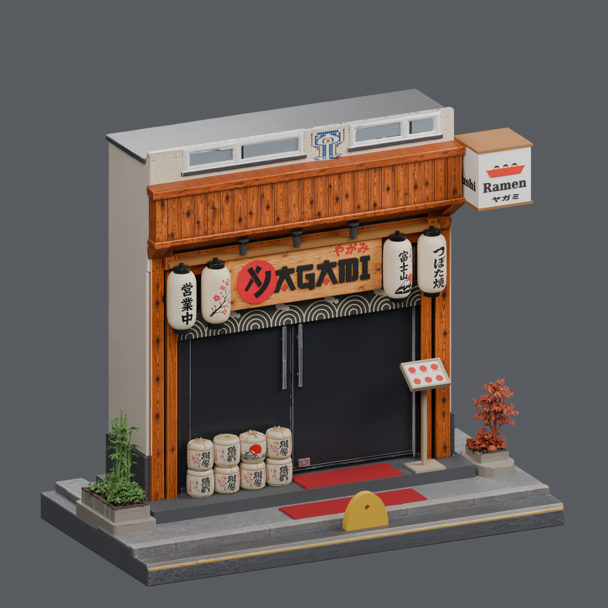
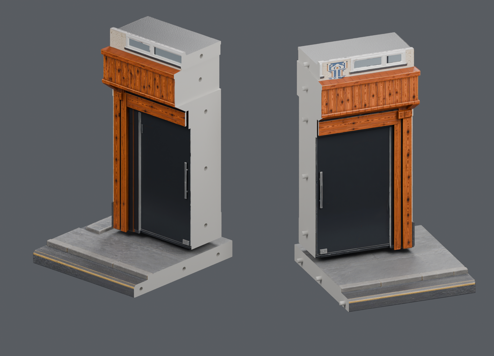

# Japan Shop — Yagami

Güncel model seti **[final7](final7/OKU_BENI.md)** klasöründedir. Kullanıcının verdiği izometrik referansa göre hazırlanmış, 30 ayrı parçadan oluşan dış cephe maketidir. Toplam yükseklik tabla dahil **216 mm**. Taban ve bina gövdesi, ELEGOO Saturn 4 Ultra'da (218,88 × 122,88 × 220 mm) 30–45° eğik basılabilmesi için ikiye bölündü; yarımlarda hizalama pimleri vardır.

- [Baskı için ayrı STL dosyaları](final7/stl_baski)
- [Montaj koordinatlarında STL dosyaları](final7/stl_montaj)
- [Bölme, baskı ve montaj açıklamaları](final7/OKU_BENI.md)
- [Parça ölçüleri](final7/parcalar.json)
- [Geometri kontrol sonuçları](final7/kontrol_raporu.json)





STL dosyaları renk/doku içermez. Bina kapalı cephe olarak modellenmiştir; iç mekân mobilyaları dahil değildir. Küçük grafiklerde sadeleştirmeler vardır. Ayrıntılı kapsam ve fiziksel baskı notları [paket açıklamasında](final7/OKU_BENI.md) bulunur.

## Kontrolleri tekrar çalıştırma

```sh
python -m pip install -r rebuild_v2/requirements.txt
python rebuild_v2/scripts/validate_final.py final7
blender -b final7/japan_shop_final.blend --python rebuild_v2/scripts/verify_scene.py
```

Üretim referansları ve yeniden oluşturma betikleri `rebuild_v2/` altındadır. Ham servis yanıtları, erişim anahtarları ve geçici dosyalar depoya dahil değildir. Önceki `final3`–`final6` setleri geçmiş sürüm olarak korunmuştur. `final5` sürümünde yerleşim ve temaslar düzeltildi; eski iki saksı yanlara eklendi. 240 mm yüksekliğindeki final5 Blender sahnesi [final5 sürüm paketindedir](https://github.com/mtarikucar/japan-shop/releases/tag/final5-2026-09-22). `final6` bina üst katını 24 mm kısaltır (bölünmemiş, 28 parça). `final7`, final6'daki taban ve binayı ikiye böler; diğer 26 parça final6 ile aynıdır.
