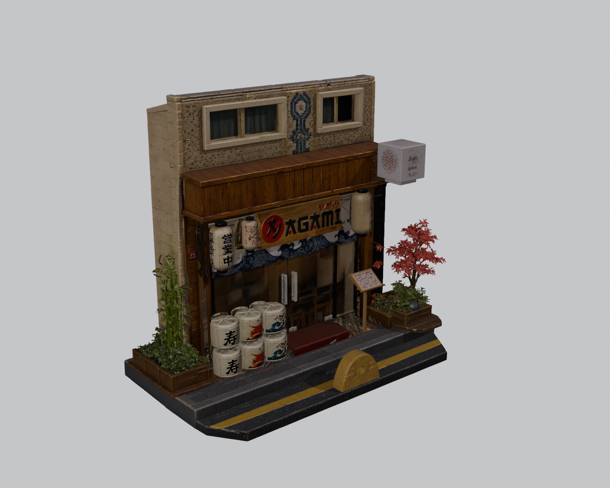
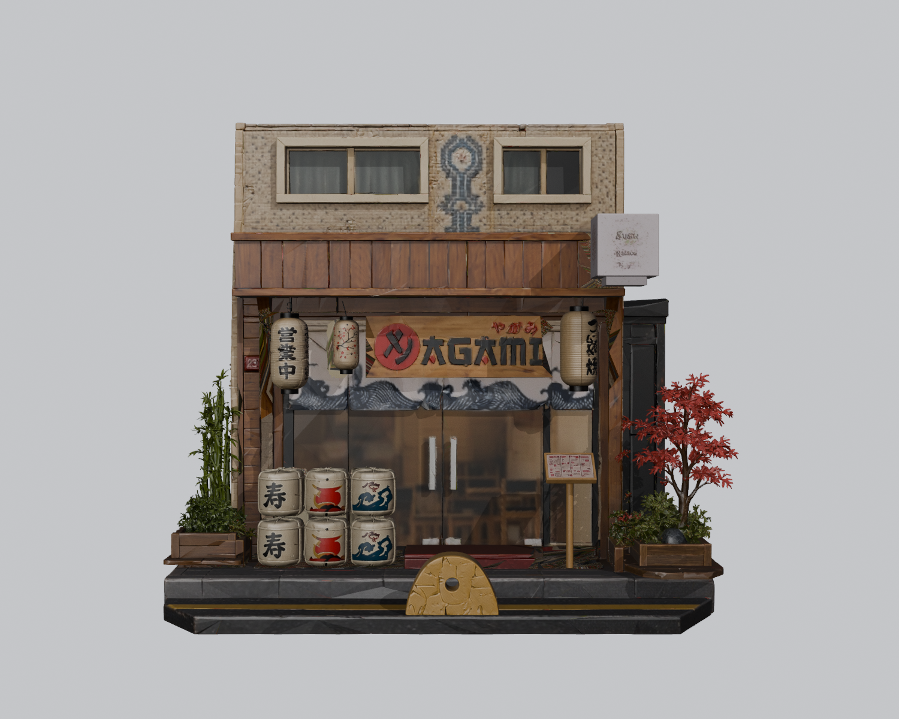
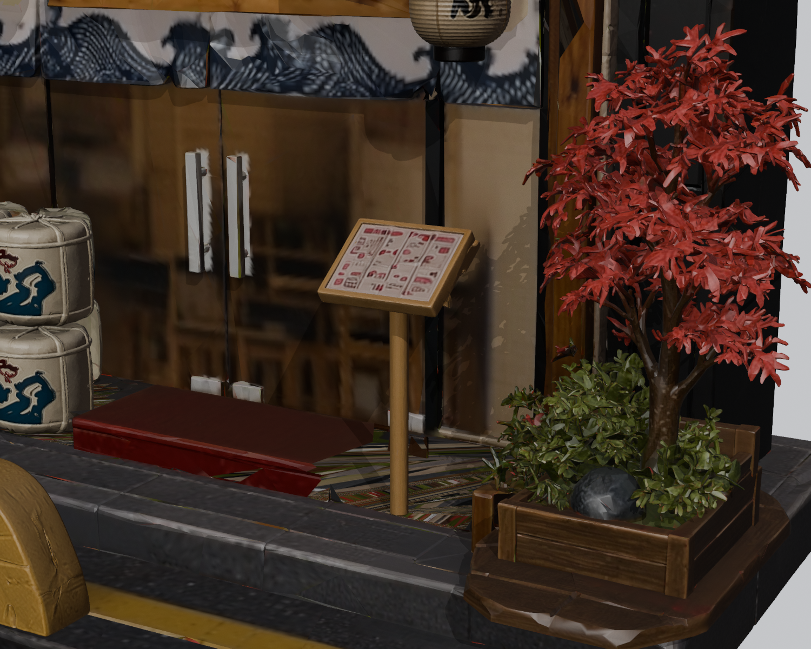

# Japan Shop

Japon dükkânı maketinin son STL seti: `final3/` klasöründeki 12 parça.

STL dosyaları milimetre ölçeğindedir. Toplam model yüksekliği yaklaşık 240 mm’dir. Parça ölçüleri [BOYUTLAR.txt](final3/BOYUTLAR.txt) dosyasında yer alır.

Parçalar ortak koordinat sistemindedir: +X sağ, -Y ön cephe, +Z yukarı.

## Önizleme

