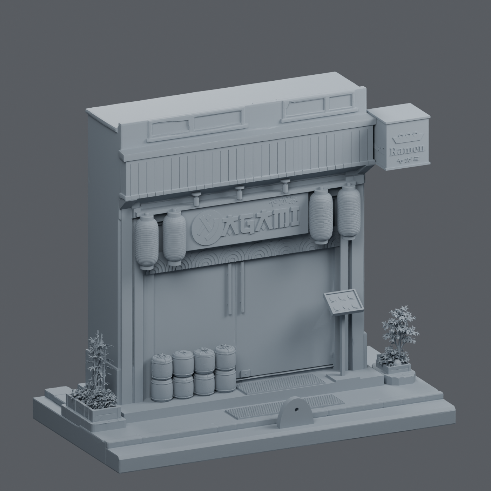

# Japan Shop — Yagami

Güncel model seti **[final6](final6/OKU_BENI.md)** klasöründedir. Kullanıcının verdiği izometrik referansa göre hazırlanmış, 28 ayrı parçadan oluşan dış cephe maketidir. 22 cm'lik baskı alanına sığması için binanın pencereli üst katı 24 mm kısaltıldı; toplam yükseklik **216 mm** (bina tek başına 193,4 mm).

- [Baskı için ayrı STL dosyaları](final6/stl_baski)
- [Montaj koordinatlarında STL dosyaları](final6/stl_montaj)
- [Montaj, baskı ve kısaltma açıklamaları](final6/OKU_BENI.md)
- [Parça ölçüleri](final6/parcalar.json)
- [Geometri kontrol sonuçları](final6/kontrol_raporu.json)




STL dosyaları renk/doku içermez. Bina kapalı cephe olarak modellenmiştir; iç mekân mobilyaları dahil değildir. Küçük grafiklerde sadeleştirmeler vardır. Ayrıntılı kapsam ve fiziksel baskı notları [paket açıklamasında](final6/OKU_BENI.md) bulunur.

## Kontrolleri tekrar çalıştırma

```sh
python -m pip install -r rebuild_v2/requirements.txt
python rebuild_v2/scripts/validate_final.py final6
blender -b final6/japan_shop_final.blend --python rebuild_v2/scripts/verify_scene.py
```

Üretim referansları ve yeniden oluşturma betikleri `rebuild_v2/` altındadır. Ham servis yanıtları, erişim anahtarları ve geçici dosyalar depoya dahil değildir. Önceki `final3`, `final4` ve `final5` setleri geçmiş sürüm olarak korunmuştur. `final5` sürümünde yerleşim ve temaslar düzeltildi; eski iki saksı yanlara eklendi. 240 mm yüksekliğindeki final5 Blender sahnesi [final5 sürüm paketindedir](https://github.com/mtarikucar/japan-shop/releases/tag/final5-2026-09-22). `final6` yalnızca bina üst katını kısaltır; diğer 27 parça final5 ile aynıdır.
