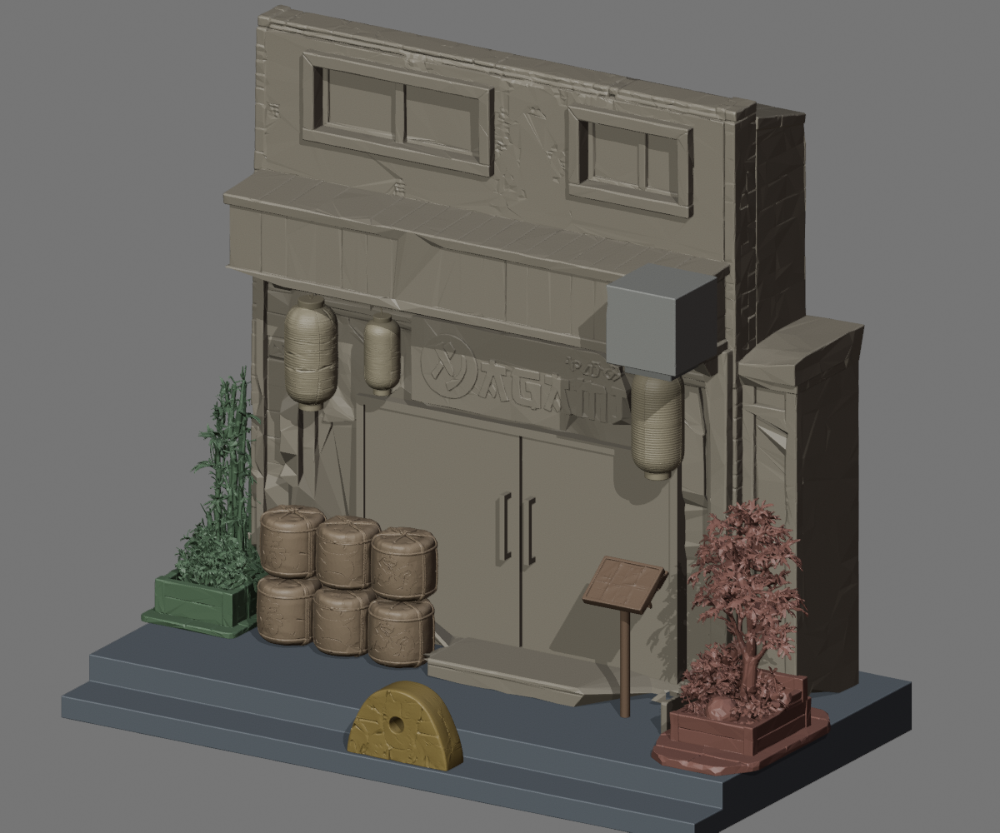
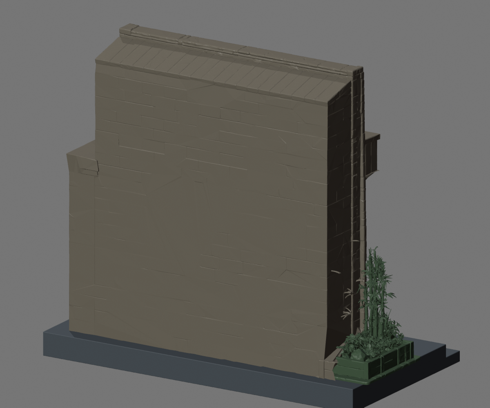
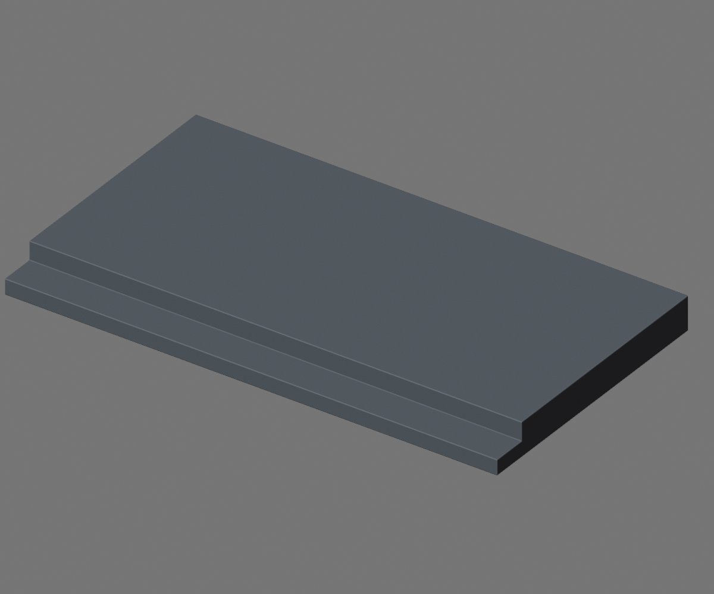

# Japan Shop

Japon dükkânı maketinin onarılmış 12 STL parçası `final3/` klasöründedir. Birimler milimetre; toplam yükseklik yaklaşık 240 mm. +X sağ, -Y ön cephe, +Z yukarı.

- [Blender dosyası](final3/japan_shop_repaired.blend)
- [Ölçüler](final3/BOYUTLAR.txt)
- [Onarım ve kontrol raporu](validation/REPAIR_REPORT.md)

## Güncel STL önizlemesi

Bunlar onarılmış geometriden Blender'da alınan görüntülerdir. Renkler parçaları ayırt etmek içindir; STL dosyaları doku içermez.





Önceki dokulu referans görselleri `birlesik_34.png`, `birlesik_on.png` ve `menu_yakin.png` adlarıyla korunmuştur. Eski STL sürümü Git geçmişindeki `39bd9b4` commit'indedir.

## Kontrolü tekrar çalıştırma

Python ortamında `numpy`, `trimesh` ve `scipy` kurulu olmalıdır:

```sh
python validation/validate_meshes.py
```
