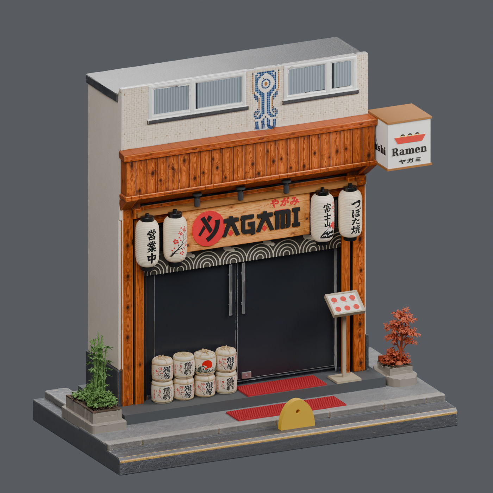
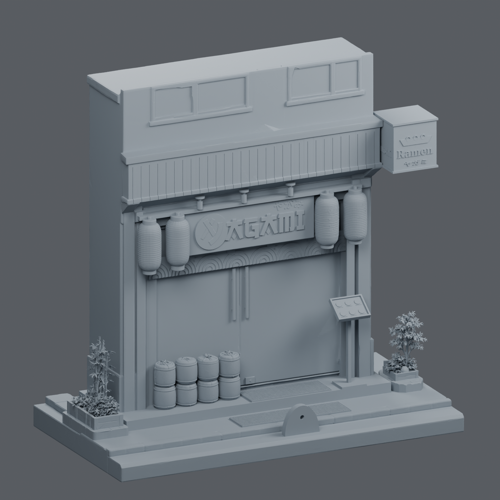

# Japan Shop — Yagami

Güncel model seti **[final5](final5/OKU_BENI.md)** klasöründedir. Kullanıcının verdiği izometrik referansa göre yeniden hazırlanmış, toplam 24 cm yüksekliğinde ve 28 ayrı parçadan oluşan dış cephe maketidir.

- [Baskı için ayrı STL dosyaları](final5/stl_baski)
- [Montaj koordinatlarında STL dosyaları](final5/stl_montaj)
- [Blender sahnesi dahil tam paket](https://github.com/mtarikucar/japan-shop/releases/tag/final5-2026-09-22)
- [Montaj ve baskı açıklamaları](final5/OKU_BENI.md)
- [Parça ölçüleri](final5/parcalar.json)
- [Geometri kontrol sonuçları](final5/kontrol_raporu.json)





STL dosyaları renk/doku içermez. Bina kapalı cephe olarak modellenmiştir; iç mekân mobilyaları dahil değildir. Küçük grafiklerde sadeleştirmeler vardır. Ayrıntılı kapsam ve fiziksel baskı notları [paket açıklamasında](final5/OKU_BENI.md) bulunur.

## Kontrolleri tekrar çalıştırma

```sh
python -m pip install -r rebuild_v2/requirements.txt
python rebuild_v2/scripts/validate_final.py final5
blender -b final5/japan_shop_final.blend --python rebuild_v2/scripts/verify_scene.py
```

Üretim referansları ve yeniden oluşturma betikleri `rebuild_v2/` altındadır. Ham servis yanıtları, erişim anahtarları ve geçici dosyalar depoya dahil değildir. Önceki `final3` ve `final4` setleri geçmiş sürüm olarak korunmuştur. `final5` sürümünde yerleşim ve temaslar düzeltildi; eski iki saksı yanlara eklendi.
